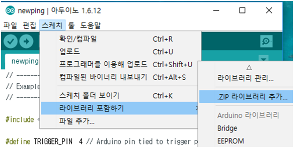
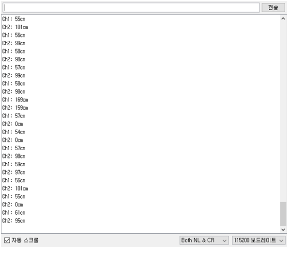

## HC-SR04 초음파 센서 응용 1편 예제 코드

### 연결도

<pre>

SR04 첫 번째
#1, VCC      -     5V
#2, Trig     -      5~
#3, Echo     -      4
#4, GND      -     GND

SR04 두 번째
#1, VCC      -     5V
#2, Trig     -      3~
#3, Echo     -      2
#4, GND      -     GND

</pre>

### 라이브러리 설치

1- 아래의 링크에 접속하여 최신 zip파일 다운로드

https://bitbucket.org/teckel12/arduino-new-ping/downloads/

 

2- 아두이노 IDE 메뉴 > 스케치 > 라이브러리 포함하기 > .ZIP 라이브러리 추가… 선택

3- 탐색창이 나타났다면 조금 전 우리가 다운로드한 파일을 (NewPing_V1.9.0.zip (글 장성시))
을 선택하고 열기 버튼을 눌러 추가합니다.

 
 

### 결과
모니터 프로그램 출력

