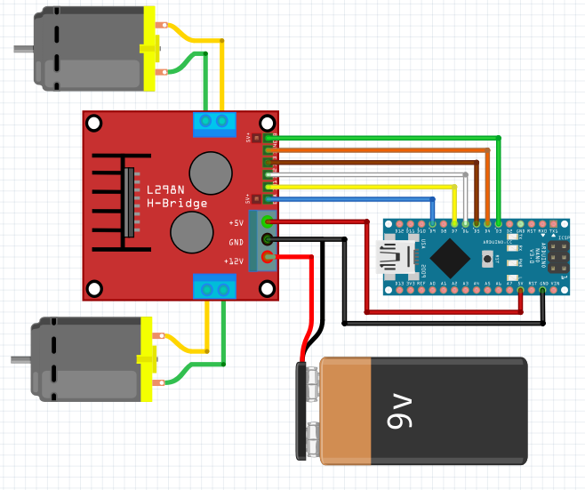

## DC 모터 드라이버(L298) 응용 1편 예제 코드

DC 모터 두 개 제어하기

앞, 뒤, 좌, 우, 속도 제어

### 연결도

<pre>
  L298      아두이노
#1, ENA   -    D9
#2, IN1   -    D7
#3, IN2   -    D6
#4, IN3   -    D5
#4, IN4   -    D4
#4, ENB   -    D3
</pre>

 
 
